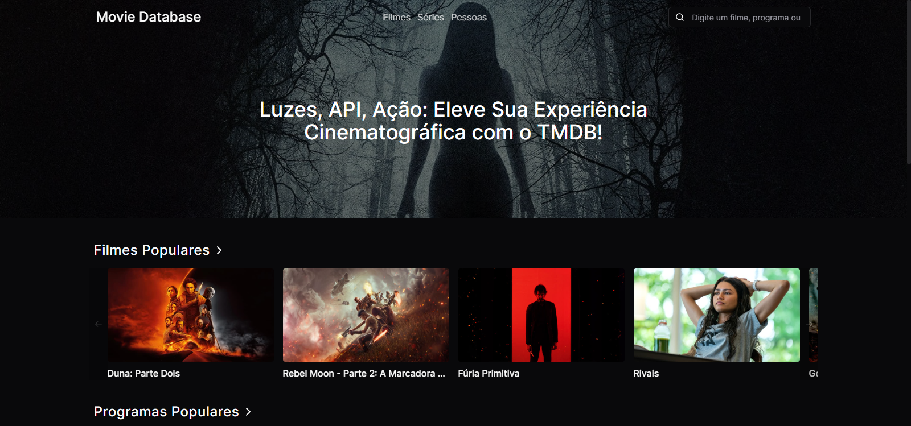

# Movie Database Project



## Descrição

Este é um aplicativo React que utiliza a API The Movie Database (TMDB) para exibir filmes e programas de TV mais populares e mais avaliados, pessoas populares, e dados detalhados sobre filmes, programas de TV e pessoas. O projeto foi desenvolvido com React, TypeScript, React Router, Tanstack Query, Tailwind CSS e Shadcn UI.

[Link do Site](https://movie-database-project.vercel.app)

## Funcionalidades

- Visualizar filmes e programas de TV mais populares.

- Visualizar pessoas populares.

- Pesquisar por filmes, programas de TV e pessoas.

- Visualizar informações detalhadas sobre filmes, programas de TV e pessoas.

## Como Executar

1. Clone o repositório.
2. Instale as dependências usando o comando:
   ```
   npm install
   ```
3. Crie um arquivo `.env` na raiz do diretório e adicione sua chave de API do TMDB:
   ```
   VITE_REACT_APP_API_KEY=sua_chave_da_api_tmdb
   ```
4. Inicie o aplicativo com:
   ```
   npm run dev
   ```
5. Abra o aplicativo no seu navegador.

## Utilização

- Ao iniciar o aplicativo, você verá a página inicial exibindo os filmes e programas de TV mais populares.
- Você pode navegar para diferentes seções usando a barra de navegação no topo.
- Use a barra de pesquisa para pesquisar filmes, programas de TV e pessoas.

## Contribuições

Contribuições são bem-vindas! Sinta-se à vontade para abrir problemas ou enviar pull requests.
